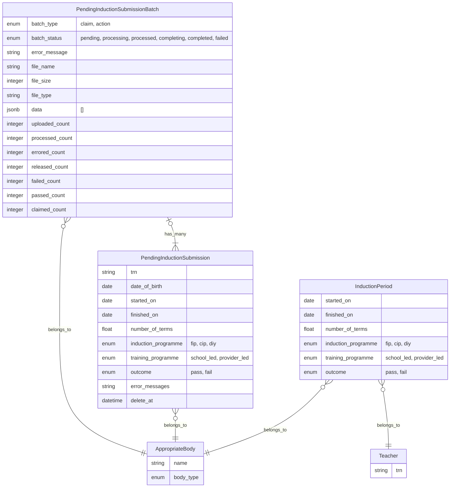

# CSV processing for multiple Appropriate Body claims and outcomes

The "bulk upload" feature allows ABs to upload a CSV file and process multiple ECT claims
or process multiple ECT outcomes and releases more efficiently.

### Entity relationship diagram

## Existing manual journey

- The manual journeys gather data in draft form before making changes to important data in the service.
- Drafted and validated `PendingInductionSubmission`s would be turned into an `InductionPeriod` or `Teacher` change
- `PendingInductionSubmission`s are ephemeral and deleted the next day if they are successful

## Technical approach

- The initial spike saved files to disk and attempted to convert each row immediately.
- We wanted to co-opt the existing manual journey models and services where possible to minimise duplication.
- A file is converted into submissions similar to the manual journey and grouped with a parent record `PendingInductionSubmissionBatch`, unlike submissions these are retained.
- Decided against storing files and adding ActiveStorage for lower overhead and easier deployment, instead we process data in memory and store as JSON in the database.
- Data is processed asynchronously in two stages to support the "Check your answers" pattern.
- Validations needed to behave slightly differently to the manual journey with extra formatting validations and different messages, surfaced with a particular hierarchy.
- The `PendingInductionSubmissionBatch` record is either a "claim" or "action" type, with the latter resulting in pass or fail outcomes, or releases.
- A batch transitions through various states, with "processing" potentially taking minutes to complete for large files and the user experience uses dynamic page updates to track progress.
- Any batch that contains rows that could not be actioned retains its submissions and data which are combined for the user to download as a CSV with actionable errors.

## Implementation details

- The bulk feature is powered by SolidQueue jobs delegating to services and Hotwire for dynamic page updates.
- ECT checks use both TRN and DoB. The database submission TRN field has constraints so extra guard logic was necessary.
- The only file format we accept is CSV, and the files we generate use quotations around cells. There are two templates, one for each batch type. All dates must use the ISO8601 standard. The maximum number of rows we allow is 1k.
- CSV rows are wrapped in `Data` objects for processing which enforce the templates and encapsulate the common formatting logic.
- Counts of outcomes and failures are tallied before CSV data which contains PII is redacted and submissions pruned as usual
- Batch jobs use inheritance to defer to a dedicated service class which have their own queue. The queue is higher priority like the mailers because it impacts the user experience.
- The event records were updated to associate to batches and it is through events we are able to determine which inductions were done via a bulk upload.

## Considerations

- During the initial development of bulk outcomes we also fast-tracked bulk claims to facilitate manual testing.
- Prior to release we surfaced database changes to enable better testing and these became the first draft of an admin console.
- Upon release the feature helped flag that worker queue config and pod resources needed attention.
- Initial usage highlighted that using the CYA approach needed further consideration as external changes could invalidate rows.

## Status indicators

These are database enforced `enum` values for a batch.

1. **pending**

`pending` is the initial state of a batch record when it is created using the file data uploaded.
It is a transitory state and should not be seen for long.

2. **processing**

Once the background job responsible for checking each row and converting it into a pending submission record begins,
it changes the batch status from `pending` to `processing`.
It is a transitory state and should not be seen for long, depending on the size of the file, no more than 5 minutes.

3. **processed**

Once the background job has converted all rows to pending submission record it changes the batch status from `processing` to `processed`.

This is a stable state.

If any rows were valid and their associated pending submission can be converted into a claim, outcome or release,
the service waits for the user to confirm before proceeding.
The length of time depending on the size of the file, no more than 5 minutes.

If all rows are invalid and no actionable data is available `processed` is also the final status for the batch.

4. **completing**

Any valid data once confirmed by the user will cause the background job to run again.
The background job changes the status from `processed` to `completing`.
It is a transitory state and should not be seen for long; it will be much quicker than the time taken to process.

5. **completed**

Once the background job has converted all pending submission records to teacher and induction period amendments,
it changes the batch status from `completing` to `completed`.

This is a stable state and the final state for either partially or completely successful batches.

6. **failed**

This batch status is reserved for internal errors.

It is a stable state and the only state for a batch that cannot be handled by the job.

It should not be seen on production and indicates there has been an issue requiring action from the development team.

## Inferred statuses

1. **blocked**

`processed` and every row had an error meaning all the data was invalid and no changes can be made.

No user action is required with this batch. A second upload with a corrected file is necessary.

2. **idle**

`processed` and at least some rows had valid data but the changes have not yet been confirmed.

User action is required.
