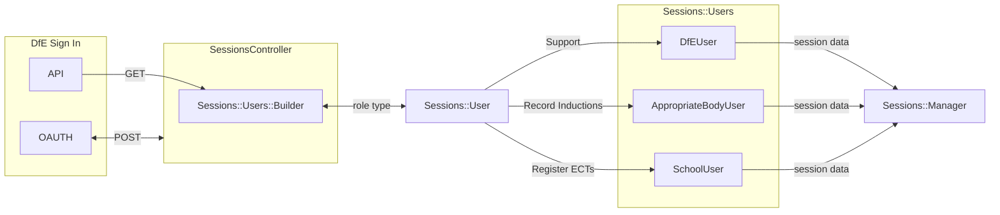

# DfE Sign In

Role-based access control is delegated to DfE Sign In's API.

https://github.com/DFE-Digital/login.dfe.public-api

The service is named `Register early career teachers` on DfE Sign In.

It has sub-services that eligible organisations can access:

- `Register ECTs`
- `Record Inductions`
- `Support` (internal admin)

These are controlled by policies and roles which are maintained by the DfE Sign In team through
ServiceNow requests.

## Setup

Configure all `DFE_SIGN_IN_` environment variables.

- The test environment (`test-`) is used locally in development.
- The pre-production environment (`pp-`) is used on the staging deployment.
- The production environment is used on the live production deployment.
- The development environment (`dev-`) is not used and is reserved for the DSI team.

- [Local development](https://test-manage.signin.education.gov.uk/services/08F10A15-020A-4798-9375-ED381024BE78)
- [Staging](https://pp-manage.signin.education.gov.uk/services/79907828-CF78-4D49-B433-4F255EE904E7)
- [Production](https://manage.signin.education.gov.uk/services/xxx)

NB: The UUID of an organisation is different across environments and seed data
needs to accommodate this to work effectively.

## Implementation

- `Sessions::Users::Builder` retrieves a user's roles to determine their session type.
- `Sessions::Manager` loads, unloads and edits the session, setting the current user.
- Controllers use `#authorised?` to check the current user session type.
- `Sessions::User` is the current user base object.

## Policies and roles

1. `Record Inductions - Appropriate Bodies` policy assigns the `AppropriateBodyUser` role
2. `Register ECTs - Schools` policy assigns the `SchoolUser` role
3. `Support - Internal` policy assigns the `DfEUser` role

An organisation used for testing purposes on test and pre-prod environments exists and
team members can be invited or request access.

**Angel Oak Academy**

`Angel Oak Academy` appears in two policies therefore approvers can assign one
or both roles `AppropriateBodyUser` and `SchoolUser`. On the live service a user with both
roles is a School Induction Tutor (SIT).

A user with both roles will first land on RECT as a school user but can switch in service to RIAB.

In RIAB the school (lead) appears as `STEP Ahead Teaching School Hub`.

- TYPE: `Establishment`
- URN: `141666`
- UPIN: `131651`
- UKPRN: `10048238`

- [Local development](https://test-manage.signin.education.gov.uk/services/08F10A15-020A-4798-9375-ED381024BE78/organisations/83173E6F-BA28-4654-A3DF-8279D573AB09/users)
- [Staging](https://pp-manage.signin.education.gov.uk/services/79907828-CF78-4D49-B433-4F255EE904E7/organisations/62FAFD5E-2C25-4214-91AD-1DE69262820A/users)

**DfE - Register Early Career Teachers - Internal User Group**

The service's `Internal User Group` assigns the `DfEUser` role.

- [Local development](https://test-manage.signin.education.gov.uk/services/08F10A15-020A-4798-9375-ED381024BE78/organisations/9C5849E3-94F5-41BA-B1A9-0D68EF34C765/users)
- [Staging](https://pp-manage.signin.education.gov.uk/services/79907828-CF78-4D49-B433-4F255EE904E7/organisations/B9E087EE-914D-435A-952A-1774D906EEFF/users)
- [Production](https://manage.signin.education.gov.uk/services/xxx/organisations/xxx/users)

## Sessions

The session data stores the user's available roles and their last used role for context.
Users can switch between roles at the same organisation without re-authenticating.
