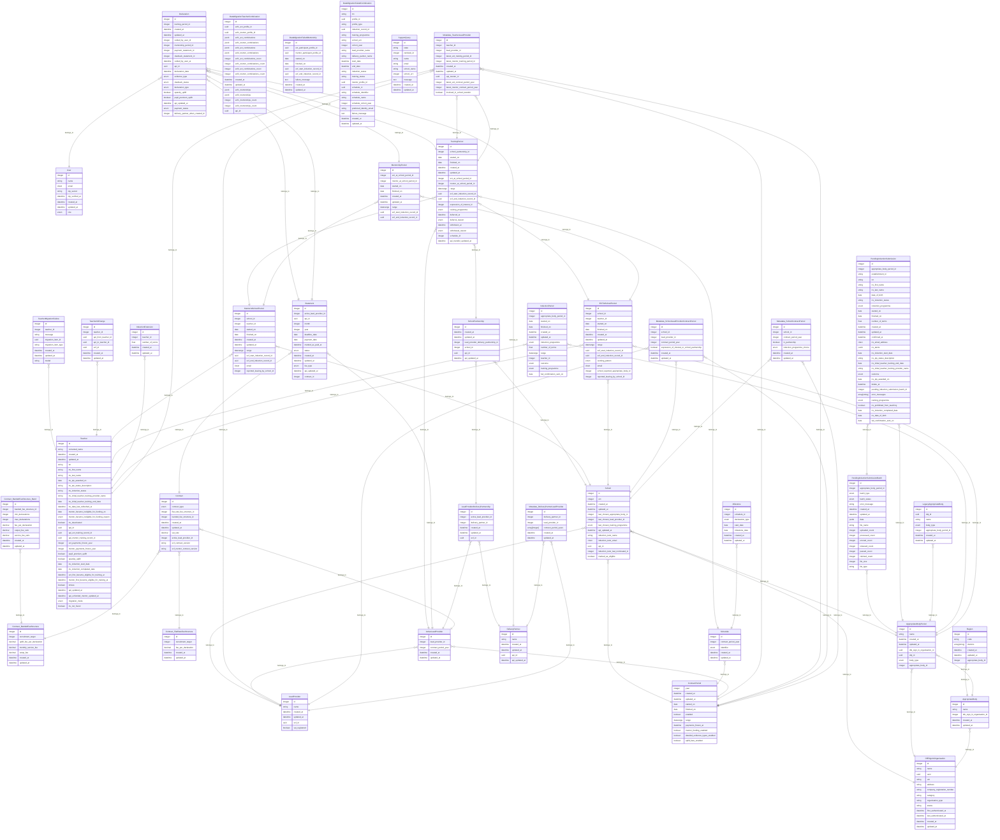

```mermaid
erDiagram
  Contract_BandedFeeStructure_Band {
    integer id
    integer banded_fee_structure_id
    integer min_declarations
    integer max_declarations
    decimal fee_per_declaration
    decimal output_fee_ratio
    decimal service_fee_ratio
    datetime created_at
    datetime updated_at
  }
  Contract_BandedFeeStructure_Band }o--|| Contract_BandedFeeStructure : belongs_to
  Contract_FlatRateFeeStructure {
    integer id
    integer recruitment_target
    decimal fee_per_declaration
    datetime created_at
    datetime updated_at
  }
  Contract_BandedFeeStructure {
    integer id
    integer recruitment_target
    decimal uplift_fee_per_declaration
    decimal monthly_service_fee
    decimal setup_fee
    datetime created_at
    datetime updated_at
  }
  User {
    integer id
    string name
    citext email
    string otp_secret
    datetime otp_verified_at
    datetime created_at
    datetime updated_at
    enum role
  }
  TrainingPeriod {
    integer id
    integer school_partnership_id
    date started_on
    date finished_on
    datetime created_at
    datetime updated_at
    integer ect_at_school_period_id
    integer mentor_at_school_period_id
    daterange range
    uuid ecf_start_induction_record_id
    uuid ecf_end_induction_record_id
    integer expression_of_interest_id
    enum training_programme
    datetime deferred_at
    enum deferral_reason
    datetime withdrawn_at
    enum withdrawal_reason
    integer schedule_id
    datetime api_transfer_updated_at
  }
  TrainingPeriod }o--|| ECTAtSchoolPeriod : belongs_to
  TrainingPeriod }o--|| MentorAtSchoolPeriod : belongs_to
  TrainingPeriod }o--|| SchoolPartnership : belongs_to
  TrainingPeriod }o--|| Schedule : belongs_to
  TrainingPeriod }o--|| ActiveLeadProvider : belongs_to
  TeacherMigrationFailure {
    integer id
    integer teacher_id
    string message
    uuid migration_item_id
    string migration_item_type
    datetime created_at
    datetime updated_at
    string model
  }
  TeacherMigrationFailure }o--|| Teacher : belongs_to
  TeacherIdChange {
    integer id
    integer teacher_id
    uuid api_from_teacher_id
    uuid api_to_teacher_id
    uuid ecf_id
    datetime created_at
    datetime updated_at
  }
  TeacherIdChange }o--|| Teacher : belongs_to
  Statement {
    integer id
    integer active_lead_provider_id
    uuid api_id
    integer month
    integer year
    date deadline_date
    date payment_date
    datetime marked_as_paid_at
    enum status
    datetime created_at
    datetime updated_at
    enum fee_type
    datetime api_updated_at
    integer contract_id
  }
  Statement }o--|| ActiveLeadProvider : belongs_to
  Statement }o--|| Contract : belongs_to
  SchoolPartnership {
    integer id
    datetime created_at
    datetime updated_at
    integer lead_provider_delivery_partnership_id
    integer school_id
    uuid api_id
    datetime api_updated_at
  }
  SchoolPartnership }o--|| LeadProviderDeliveryPartnership : belongs_to
  SchoolPartnership }o--|| School : belongs_to
  School {
    integer id
    integer urn
    datetime created_at
    datetime updated_at
    integer last_chosen_appropriate_body_id
    integer last_chosen_lead_provider_id
    enum last_chosen_training_programme
    datetime api_updated_at
    string induction_tutor_name
    citext induction_tutor_email
    uuid api_id
    integer induction_tutor_last_nominated_in
    boolean marked_as_eligible
  }
  School }o--|| DfESignInOrganisation : belongs_to
  School }o--|| AppropriateBodyPeriod : belongs_to
  School }o--|| LeadProvider : belongs_to
  School }o--|| ContractPeriod : belongs_to
  Schedule {
    integer id
    integer contract_period_year
    enum identifier
    datetime created_at
    datetime updated_at
  }
  Schedule }o--|| ContractPeriod : belongs_to
  Region {
    integer id
    string code
    array[string] districts
    datetime created_at
    datetime updated_at
    integer appropriate_body_id
  }
  Region }o--|| AppropriateBody : belongs_to
  PendingInductionSubmissionBatch {
    integer id
    integer appropriate_body_period_id
    enum batch_type
    enum batch_status
    string error_message
    datetime created_at
    datetime updated_at
    jsonb data
    string file_name
    integer uploaded_count
    integer processed_count
    integer errored_count
    integer released_count
    integer passed_count
    integer claimed_count
    integer file_size
    string file_type
  }
  PendingInductionSubmissionBatch }o--|| AppropriateBodyPeriod : belongs_to
  Teacher {
    integer id
    string corrected_name
    datetime created_at
    datetime updated_at
    string trn
    string trs_first_name
    string trs_last_name
    date trs_qts_awarded_on
    string trs_qts_status_description
    string trs_induction_status
    string trs_initial_teacher_training_provider_name
    date trs_initial_teacher_training_end_date
    datetime trs_data_last_refreshed_at
    date mentor_became_ineligible_for_funding_on
    enum mentor_became_ineligible_for_funding_reason
    boolean trs_deactivated
    uuid api_id
    uuid api_ect_training_record_id
    uuid api_mentor_training_record_id
    integer ect_payments_frozen_year
    integer mentor_payments_frozen_year
    boolean pupil_premium_uplift
    boolean sparsity_uplift
    date trs_induction_start_date
    date trs_induction_completed_date
    datetime ect_first_became_eligible_for_training_at
    datetime mentor_first_became_eligible_for_training_at
    boolean trnless
    datetime api_updated_at
    datetime api_unfunded_mentor_updated_at
    enum migration_mode
    boolean trs_not_found
  }
  PendingInductionSubmission {
    integer id
    integer appropriate_body_period_id
    string establishment_id
    string trn
    string trs_first_name
    string trs_last_name
    date date_of_birth
    string trs_induction_status
    enum induction_programme
    date started_on
    date finished_on
    float number_of_terms
    datetime created_at
    datetime updated_at
    datetime confirmed_at
    citext trs_email_address
    jsonb trs_alerts
    date trs_induction_start_date
    string trs_qts_status_description
    date trs_initial_teacher_training_end_date
    string trs_initial_teacher_training_provider_name
    enum outcome
    date trs_qts_awarded_on
    datetime delete_at
    integer pending_induction_submission_batch_id
    array[string] error_messages
    enum training_programme
    boolean trs_prohibited_from_teaching
    date trs_induction_completed_date
    date trs_date_of_birth
    date fail_confirmation_sent_on
  }
  PendingInductionSubmission }o--|| AppropriateBodyPeriod : belongs_to
  PendingInductionSubmission }o--|| PendingInductionSubmissionBatch : belongs_to
  Milestone {
    integer id
    integer schedule_id
    enum declaration_type
    date start_date
    date milestone_date
    datetime created_at
    datetime updated_at
  }
  Milestone }o--|| Schedule : belongs_to
  MentorshipPeriod {
    integer id
    integer ect_at_school_period_id
    integer mentor_at_school_period_id
    date started_on
    date finished_on
    datetime created_at
    datetime updated_at
    daterange range
    uuid ecf_start_induction_record_id
    uuid ecf_end_induction_record_id
  }
  MentorshipPeriod }o--|| ECTAtSchoolPeriod : belongs_to
  MentorshipPeriod }o--|| MentorAtSchoolPeriod : belongs_to
  MentorAtSchoolPeriod {
    integer id
    integer school_id
    integer teacher_id
    date started_on
    date finished_on
    datetime created_at
    datetime updated_at
    daterange range
    uuid ecf_start_induction_record_id
    uuid ecf_end_induction_record_id
    citext email
    integer reported_leaving_by_school_id
  }
  MentorAtSchoolPeriod }o--|| School : belongs_to
  MentorAtSchoolPeriod }o--|| Teacher : belongs_to
  LegacyAppropriateBody {
    integer id
    uuid dqt_id
    string name
    enum body_type
    integer appropriate_body_period_id
    datetime created_at
    datetime updated_at
  }
  LegacyAppropriateBody }o--|| AppropriateBodyPeriod : belongs_to
  LeadProviderDeliveryPartnership {
    integer id
    integer active_lead_provider_id
    integer delivery_partner_id
    datetime created_at
    datetime updated_at
    uuid ecf_id
  }
  LeadProviderDeliveryPartnership }o--|| ActiveLeadProvider : belongs_to
  LeadProviderDeliveryPartnership }o--|| DeliveryPartner : belongs_to
  LeadProvider {
    integer id
    string name
    datetime created_at
    datetime updated_at
    uuid ecf_id
    boolean vat_registered
  }
  InductionPeriod {
    integer id
    integer appropriate_body_period_id
    date started_on
    date finished_on
    datetime created_at
    datetime updated_at
    enum induction_programme
    float number_of_terms
    daterange range
    integer teacher_id
    enum outcome
    enum training_programme
    date fail_confirmation_sent_on
  }
  InductionPeriod }o--|| AppropriateBodyPeriod : belongs_to
  InductionPeriod }o--|| Teacher : belongs_to
  InductionExtension {
    integer id
    integer teacher_id
    float number_of_terms
    datetime created_at
    datetime updated_at
  }
  InductionExtension }o--|| Teacher : belongs_to
  ECTAtSchoolPeriod {
    integer id
    integer school_id
    integer teacher_id
    date started_on
    date finished_on
    datetime created_at
    datetime updated_at
    daterange range
    uuid ecf_start_induction_record_id
    uuid ecf_end_induction_record_id
    enum working_pattern
    citext email
    integer school_reported_appropriate_body_id
    integer reported_leaving_by_school_id
  }
  ECTAtSchoolPeriod }o--|| School : belongs_to
  ECTAtSchoolPeriod }o--|| Teacher : belongs_to
  ECTAtSchoolPeriod }o--|| AppropriateBodyPeriod : belongs_to
  DfESignInOrganisation {
    integer id
    string name
    uuid uuid
    string urn
    string address
    string company_registration_number
    string category
    string organisation_type
    string status
    datetime first_authenticated_at
    datetime last_authenticated_at
    datetime created_at
    datetime updated_at
  }
  DeliveryPartner {
    integer id
    string name
    datetime created_at
    datetime updated_at
    uuid api_id
    datetime api_updated_at
  }
  Declaration {
    integer id
    integer training_period_id
    datetime created_at
    datetime updated_at
    integer voided_by_user_id
    integer mentorship_period_id
    integer payment_statement_id
    integer clawback_statement_id
    datetime voided_by_user_at
    uuid api_id
    datetime declaration_date
    enum evidence_type
    enum clawback_status
    enum declaration_type
    boolean sparsity_uplift
    boolean pupil_premium_uplift
    datetime api_updated_at
    enum payment_status
    integer delivery_partner_when_created_id
  }
  Declaration }o--|| TrainingPeriod : belongs_to
  Declaration }o--|| User : belongs_to
  Declaration }o--|| MentorshipPeriod : belongs_to
  Declaration }o--|| DeliveryPartner : belongs_to
  Declaration }o--|| Statement : belongs_to
  Declaration }o--|| Statement : belongs_to
  DataMigrationTeacherCombination {
    integer id
    uuid ecf1_ect_profile_id
    uuid ecf1_mentor_profile_id
    jsonb ecf1_ect_combinations
    jsonb ecf1_mentor_combinations
    jsonb ecf2_ect_combinations
    jsonb ecf2_mentor_combinations
    integer ecf1_ect_combinations_count
    integer ecf1_mentor_combinations_count
    integer ecf2_ect_combinations_count
    integer ecf2_mentor_combinations_count
    datetime created_at
    datetime updated_at
    jsonb ecf1_mentorships
    jsonb ecf2_mentorships
    integer ecf1_mentorships_count
    integer ecf2_mentorships_count
    uuid api_id
  }
  DataMigrationFailedMentorship {
    integer id
    uuid ect_participant_profile_id
    uuid mentor_participant_profile_id
    date started_on
    date finished_on
    uuid ecf_start_induction_record_id
    uuid ecf_end_induction_record_id
    text failure_message
    datetime created_at
    datetime updated_at
  }
  DataMigrationFailedCombination {
    integer id
    string trn
    uuid profile_id
    string profile_type
    uuid induction_record_id
    string training_programme
    string school_urn
    integer cohort_year
    string lead_provider_name
    string delivery_partner_name
    datetime start_date
    datetime end_date
    string induction_status
    string training_status
    uuid mentor_profile_id
    uuid schedule_id
    string schedule_identifier
    string schedule_name
    integer schedule_cohort_year
    string preferred_identity_email
    text failure_message
    datetime created_at
    datetime updated_at
  }
  ContractPeriod {
    integer year
    datetime created_at
    datetime updated_at
    date started_on
    date finished_on
    boolean enabled
    daterange range
    datetime payments_frozen_at
    boolean mentor_funding_enabled
    boolean detailed_evidence_types_enabled
    boolean uplift_fees_enabled
  }
  Contract {
    integer id
    enum contract_type
    integer flat_rate_fee_structure_id
    integer banded_fee_structure_id
    datetime created_at
    datetime updated_at
    decimal vat_rate
    integer active_lead_provider_id
    string ecf_contract_version
    string ecf_mentor_contract_version
  }
  Contract }o--|| ActiveLeadProvider : belongs_to
  Contract }o--|| Contract_FlatRateFeeStructure : belongs_to
  Contract }o--|| Contract_BandedFeeStructure : belongs_to
  AppropriateBodyPeriod {
    integer id
    string name
    datetime created_at
    datetime updated_at
    uuid dfe_sign_in_organisation_id
    uuid dqt_id
    enum body_type
    integer appropriate_body_id
  }
  AppropriateBodyPeriod }o--|| DfESignInOrganisation : belongs_to
  AppropriateBodyPeriod }o--|| AppropriateBody : belongs_to
  AppropriateBody {
    integer id
    string name
    integer dfe_sign_in_organisation_id
    datetime created_at
    datetime updated_at
  }
  AppropriateBody }o--|| DfESignInOrganisation : belongs_to
  ActiveLeadProvider {
    integer id
    integer lead_provider_id
    integer contract_period_year
    datetime created_at
    datetime updated_at
  }
  ActiveLeadProvider }o--|| ContractPeriod : belongs_to
  ActiveLeadProvider }o--|| LeadProvider : belongs_to
  SupportQuery {
    integer id
    string state
    integer zendesk_id
    string name
    string email
    string school_name
    integer school_urn
    text message
    datetime created_at
    datetime updated_at
  }
  Metadata_TeacherLeadProvider {
    integer id
    integer teacher_id
    integer lead_provider_id
    integer latest_ect_training_period_id
    integer latest_mentor_training_period_id
    datetime created_at
    datetime updated_at
    uuid api_mentor_id
    integer latest_ect_contract_period_year
    integer latest_mentor_contract_period_year
    boolean involved_in_school_transfer
  }
  Metadata_TeacherLeadProvider }o--|| Teacher : belongs_to
  Metadata_TeacherLeadProvider }o--|| LeadProvider : belongs_to
  Metadata_TeacherLeadProvider }o--|| TrainingPeriod : belongs_to
  Metadata_TeacherLeadProvider }o--|| TrainingPeriod : belongs_to
  Metadata_TeacherLeadProvider }o--|| ContractPeriod : belongs_to
  Metadata_TeacherLeadProvider }o--|| ContractPeriod : belongs_to
  Metadata_SchoolLeadProviderContractPeriod {
    integer id
    integer school_id
    integer lead_provider_id
    integer contract_period_year
    boolean expression_of_interest_or_school_partnership
    datetime created_at
    datetime updated_at
  }
  Metadata_SchoolLeadProviderContractPeriod }o--|| School : belongs_to
  Metadata_SchoolLeadProviderContractPeriod }o--|| LeadProvider : belongs_to
  Metadata_SchoolLeadProviderContractPeriod }o--|| ContractPeriod : belongs_to
  Metadata_SchoolContractPeriod {
    integer id
    integer school_id
    integer contract_period_year
    boolean in_partnership
    enum induction_programme_choice
    datetime created_at
    datetime updated_at
  }
  Metadata_SchoolContractPeriod }o--|| School : belongs_to
  Metadata_SchoolContractPeriod }o--|| ContractPeriod : belongs_to
  Metadata_DeliveryPartnerLeadProvider {
    integer id
    integer delivery_partner_id
    integer lead_provider_id
    array[integer] contract_period_years
    datetime created_at
    datetime updated_at
  }
  Metadata_DeliveryPartnerLeadProvider }o--|| DeliveryPartner : belongs_to
  Metadata_DeliveryPartnerLeadProvider }o--|| LeadProvider : belongs_to
```