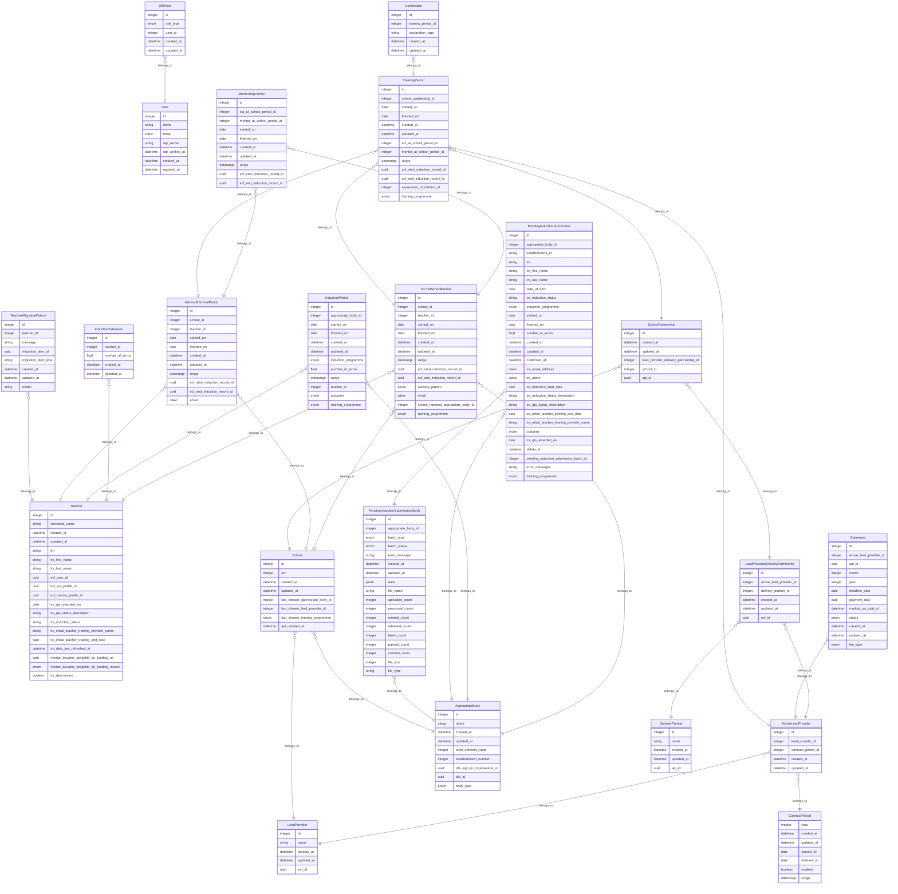

```mermaid
erDiagram
  User {
    integer id
    string name
    citext email
    string otp_secret
    datetime otp_verified_at
    datetime created_at
    datetime updated_at
  }
  TrainingPeriod {
    integer id
    integer school_partnership_id
    date started_on
    date finished_on
    datetime created_at
    datetime updated_at
    integer ect_at_school_period_id
    integer mentor_at_school_period_id
    daterange range
    uuid ecf_start_induction_record_id
    uuid ecf_end_induction_record_id
    integer expression_of_interest_id
    enum training_programme
  }
  TrainingPeriod }o--|| ECTAtSchoolPeriod : belongs_to
  TrainingPeriod }o--|| MentorAtSchoolPeriod : belongs_to
  TrainingPeriod }o--|| SchoolPartnership : belongs_to
  TrainingPeriod }o--|| ActiveLeadProvider : belongs_to
  TeacherMigrationFailure {
    integer id
    integer teacher_id
    string message
    uuid migration_item_id
    string migration_item_type
    datetime created_at
    datetime updated_at
    string model
  }
  TeacherMigrationFailure }o--|| Teacher : belongs_to
  Statement {
    integer id
    integer active_lead_provider_id
    uuid api_id
    integer month
    integer year
    date deadline_date
    date payment_date
    datetime marked_as_paid_at
    enum status
    datetime created_at
    datetime updated_at
    enum fee_type
  }
  Statement }o--|| ActiveLeadProvider : belongs_to
  SchoolPartnership {
    integer id
    datetime created_at
    datetime updated_at
    integer lead_provider_delivery_partnership_id
    integer school_id
    uuid api_id
  }
  SchoolPartnership }o--|| LeadProviderDeliveryPartnership : belongs_to
  SchoolPartnership }o--|| School : belongs_to
  School {
    integer id
    integer urn
    datetime created_at
    datetime updated_at
    integer last_chosen_appropriate_body_id
    integer last_chosen_lead_provider_id
    enum last_chosen_training_programme
    datetime api_updated_at
  }
  School }o--|| AppropriateBody : belongs_to
  School }o--|| LeadProvider : belongs_to
  PendingInductionSubmissionBatch {
    integer id
    integer appropriate_body_id
    enum batch_type
    enum batch_status
    string error_message
    datetime created_at
    datetime updated_at
    jsonb data
    string file_name
    integer uploaded_count
    integer processed_count
    integer errored_count
    integer released_count
    integer failed_count
    integer passed_count
    integer claimed_count
    integer file_size
    string file_type
  }
  PendingInductionSubmissionBatch }o--|| AppropriateBody : belongs_to
  Teacher {
    integer id
    string corrected_name
    datetime created_at
    datetime updated_at
    string trn
    string trs_first_name
    string trs_last_name
    uuid ecf_user_id
    uuid ecf_ect_profile_id
    uuid ecf_mentor_profile_id
    date trs_qts_awarded_on
    string trs_qts_status_description
    string trs_induction_status
    string trs_initial_teacher_training_provider_name
    date trs_initial_teacher_training_end_date
    datetime trs_data_last_refreshed_at
    date mentor_became_ineligible_for_funding_on
    enum mentor_became_ineligible_for_funding_reason
    boolean trs_deactivated
  }
  PendingInductionSubmission {
    integer id
    integer appropriate_body_id
    string establishment_id
    string trn
    string trs_first_name
    string trs_last_name
    date date_of_birth
    string trs_induction_status
    enum induction_programme
    date started_on
    date finished_on
    float number_of_terms
    datetime created_at
    datetime updated_at
    datetime confirmed_at
    citext trs_email_address
    jsonb trs_alerts
    date trs_induction_start_date
    string trs_induction_status_description
    string trs_qts_status_description
    date trs_initial_teacher_training_end_date
    string trs_initial_teacher_training_provider_name
    enum outcome
    date trs_qts_awarded_on
    datetime delete_at
    integer pending_induction_submission_batch_id
    string error_messages
    enum training_programme
  }
  PendingInductionSubmission }o--|| AppropriateBody : belongs_to
  PendingInductionSubmission }o--|| PendingInductionSubmissionBatch : belongs_to
  MentorshipPeriod {
    integer id
    integer ect_at_school_period_id
    integer mentor_at_school_period_id
    date started_on
    date finished_on
    datetime created_at
    datetime updated_at
    daterange range
    uuid ecf_start_induction_record_id
    uuid ecf_end_induction_record_id
  }
  MentorshipPeriod }o--|| ECTAtSchoolPeriod : belongs_to
  MentorshipPeriod }o--|| MentorAtSchoolPeriod : belongs_to
  MentorAtSchoolPeriod {
    integer id
    integer school_id
    integer teacher_id
    date started_on
    date finished_on
    datetime created_at
    datetime updated_at
    daterange range
    uuid ecf_start_induction_record_id
    uuid ecf_end_induction_record_id
    citext email
  }
  MentorAtSchoolPeriod }o--|| School : belongs_to
  MentorAtSchoolPeriod }o--|| Teacher : belongs_to
  LeadProviderDeliveryPartnership {
    integer id
    integer active_lead_provider_id
    integer delivery_partner_id
    datetime created_at
    datetime updated_at
    uuid ecf_id
  }
  LeadProviderDeliveryPartnership }o--|| ActiveLeadProvider : belongs_to
  LeadProviderDeliveryPartnership }o--|| DeliveryPartner : belongs_to
  LeadProvider {
    integer id
    string name
    datetime created_at
    datetime updated_at
    uuid ecf_id
  }
  InductionPeriod {
    integer id
    integer appropriate_body_id
    date started_on
    date finished_on
    datetime created_at
    datetime updated_at
    enum induction_programme
    float number_of_terms
    daterange range
    integer teacher_id
    enum outcome
    enum training_programme
  }
  InductionPeriod }o--|| AppropriateBody : belongs_to
  InductionPeriod }o--|| Teacher : belongs_to
  InductionExtension {
    integer id
    integer teacher_id
    float number_of_terms
    datetime created_at
    datetime updated_at
  }
  InductionExtension }o--|| Teacher : belongs_to
  ECTAtSchoolPeriod {
    integer id
    integer school_id
    integer teacher_id
    date started_on
    date finished_on
    datetime created_at
    datetime updated_at
    daterange range
    uuid ecf_start_induction_record_id
    uuid ecf_end_induction_record_id
    enum working_pattern
    citext email
    integer school_reported_appropriate_body_id
    enum training_programme
  }
  ECTAtSchoolPeriod }o--|| School : belongs_to
  ECTAtSchoolPeriod }o--|| Teacher : belongs_to
  ECTAtSchoolPeriod }o--|| AppropriateBody : belongs_to
  DfERole {
    integer id
    enum role_type
    integer user_id
    datetime created_at
    datetime updated_at
  }
  DfERole }o--|| User : belongs_to
  DeliveryPartner {
    integer id
    string name
    datetime created_at
    datetime updated_at
    uuid api_id
  }
  Declaration {
    integer id
    integer training_period_id
    string declaration_type
    datetime created_at
    datetime updated_at
  }
  Declaration }o--|| TrainingPeriod : belongs_to
  ContractPeriod {
    integer year
    datetime created_at
    datetime updated_at
    date started_on
    date finished_on
    boolean enabled
    daterange range
  }
  AppropriateBody {
    integer id
    string name
    datetime created_at
    datetime updated_at
    integer local_authority_code
    integer establishment_number
    uuid dfe_sign_in_organisation_id
    uuid dqt_id
    enum body_type
  }
  ActiveLeadProvider {
    integer id
    integer lead_provider_id
    integer contract_period_id
    datetime created_at
    datetime updated_at
  }
  ActiveLeadProvider }o--|| ContractPeriod : belongs_to
  ActiveLeadProvider }o--|| LeadProvider : belongs_to
```