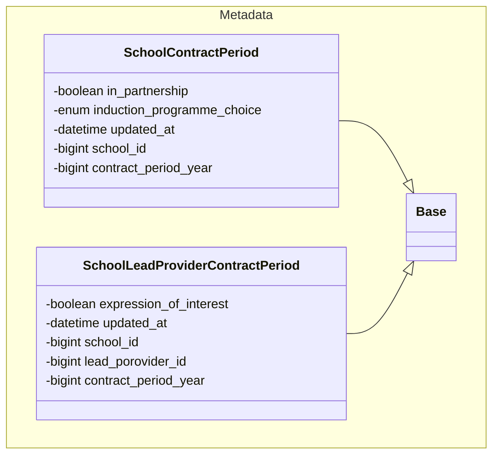
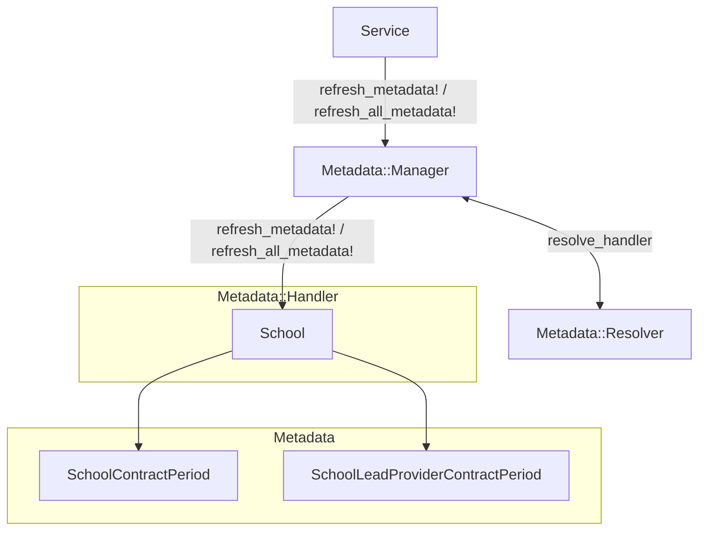

# Metadata

In RECT we have the notion of 'metadata' that is associated to certain domain models. This solves a particular set of problems we encountered when developing the lead provider APIs:

- Displaying information at a high level results in slow/complex queries on the underlying participant-level data set.
- Determining when an object in the API response has been updated.

To solve these problems we pre-compute aggregate information and save it in join tables (the models are within the `Metadata::` namespace), that can be easily and efficiently queried and can retain their own `updated_at` values.

## Background

When developing the lead provider API endpoints we hit issues with exposing data in the format we require for v3 of the API that was being ported across from ECF. We also had difficulty in determining accurate updated dates for the `updated_since` filtering.

### Exposing data in the v3 API format

In RECT - where possible - we model relationships at the participant-level, however in the lead provider API we often expose information at a higher level (for example for a particular school). This led to complicated and inefficient queries that were determining higher-level state based on underlying participant data.

We can see this in the [original Schools::Query](https://github.com/DFE-Digital/register-early-career-teachers-public/blob/770eb05dc137e88ed6e05b83a889cdb70d625523/app/services/schools/query.rb#L12-L16) whereby we return 'transient' attributes that pre-calculate information we want to expose to lead providers about a school, depending on the underlying participant data and the lead provider that is querying the API. The `expression_of_interest`, for example, would be `true` if any of the school's participants have a `TrainingPeriod` with an `expression_of_interest` to the querying lead provider.

This also meant the [resulting SchoolSerializer](https://github.com/DFE-Digital/register-early-career-teachers-public/blob/770eb05dc137e88ed6e05b83a889cdb70d625523/app/serializers/school_serializer.rb#L39-L48) was complicated, such that it had to check for the optimised transient attributes being present and fallback to N+1 queries when they were absent.

### Determining accurate updated dates

Lead providers are able to provide an `updated_since` query parameter to several of our APIs. When this is given, we should only return results that have been updated since the provided date.

This can be very complicated to figure out with the base data set, as it is often relative to the particular lead provider making the request or other filters (such as the contract period).

If we take schools as an example again, the `updated_at` of the school should change for a particular lead provider when an `expression_of_interest` is registered with a given school for one of their participants. In the current data set we have no way of storing/determining this (the `TrainingPeriod` of that participant would have the correct `updated_at` when interest is first expressed, but it could then change for other reasons).

### Solutions we explored

We looked into two solutions in order to address these issues:

- [Database views](https://github.com/DFE-Digital/register-early-career-teachers-public/pull/1031)
- [Pre-calculated values stored in join tables](https://github.com/DFE-Digital/register-early-career-teachers-public/pull/1007)

#### Database views

By creating database views we could encapsulate the complex queries and clean up our query services and serializers somewhat, however our experience in ECF indicates that this often doesn't scale well and can be difficult to debug when there are issues. It also doesn't provide a solution to the problem of accurate updated at values; we still have the same underlying data limitations, which is the primary reason we discounted this option.

#### Pre-calculated values stored in join tables

By adding join tables with attributes for pre-calculated values we are able to easily query and serialize the information for a particular lead provider (and other applicable filters such as contract period). We also now have a place where we can store a specific `updated_at` value that can be used to determine if something has changed at a granular/detailed level.

The main concerns we had with this approach were that we are de-normalising the data set and there is a risk of data integrity issues down the line (if the join table values are not refreshed when the underlying data changes).

## Technical details

### Modelling

The metadata models are all namespaced under `Metadata::` and should be a minimal join table across models that are required to determine the value of the metadata attributes. For example, to determine the `in_partnership` and `induction_programme_choice` of a school we need to know the contract period - the join table would be `Metadata::SchoolContractPeriod`. Similarly, to determine the `expression_of_interest` state of a school we need to know the lead provider and contract period, so this would be stored on `Metadata::SchoolLeadProviderContractPeriod`.

We also want to ensure metadata tables are timestamped, as the `updated_at` will often be relevant for the API `updated_since` filtering.



Note that all metadata models should inherit from `Metadata::Base`; the base class contains safety nets to ensure that the `Metadata::` model attributes are only ever updated from the `Metadata::` namespace (i.e. the metadata service). We do this to prevent any accidental updates/changes from other areas of the application.

### Service

The metadata service consists of:

- `Metadata::Manager` - the entry-point into the service.
- `Metadata::Resolver` - resolves a handler for a particular object type.
- `Metadata::Handlers::<handler>` - responsible for updating metadata for a particular object type.
- `Metadata::<model>` - models that contain the metadata attributes.

The general process for updating metadata for a given object(s) is as follows:

1. Call `Metadata::Manager#refresh_metadata!` for a given object(s).
2. The manager will iterate over the objects and call the `Metadata::Resolver` to retrieve the applicable `Metadata::Handlers::<handler>`.
3. The `Metadata::Handlers::<handler>` is instantiated with the object.
4. The manager will call `refresh_metadata!` on the `Metadata::Handlers::<handler>`.
5. The `Metadata::Handlers::<handler>` will upsert all the associated metadata.

The handlers will create or update metadata for **all combinations** of the join tables. For example, `Metadata::SchoolLeadProviderContractPeriod` will exist for _every_ combination of school, lead provider and contract period. Whilst this can result in a lot of entries, it means we can always assume metadata will exist/be present and avoids coding in default conditions for when it does not exist.

The `Metadata::Manager` also has a `refresh_all_metadata!` method, which iterates over every handler and every object for a given handler in order to refresh the entire metadata set. This method will do so synchronously by default, however it also accepts an `async: true` option which will queue the updates in background jobs (which can greatly speed up the process).

A high-level service diagram with schools metadata is as follows:



### Update restrictions

All metadata models should inherit from `Metadata::Base`. The base class has a `before_update` callback that will ensure any updates being made originate from the `Metadata::` namespace. This is to lock down and hopefully clarify how the metadata should be updated; we only ever want it to be refreshed via the `Metadata::Manager`.

### Testing

As we are locking down updates to metadata models it can make testing difficult (as it prevents updating test data for a particular scenario). To get around this there is a `bypass_update_restrictions` helper method on `Metadata::Base` that you can call:

```
metadata = FactoryBot.create(:school_contract_period_metadata)
Metadata::SchoolContractPeriod.bypass_update_restrictions { metadata.update!(in_partnership: false) }
```

### Usage

#### Refreshing metadata on changes

The metadata service is designed to provide a simple interface for ensuring metadata remains up to date. **Whenever a model is changed**, it should be passed into the `Metadata::Manager` in order to be refreshed. An example would be a service that creates a new `SchoolPartnership`, which could cause the `in_partnership` state of the school to change:

```
school = School.last
SchoolPartnership.create!(...)

Metadata::Manager.refresh_metadata!(school)
```

The manager will take care of updating any attributes that may have changed.

⚠️ It is important that the metadata service is called from **all services** that change models -- for this reason, we should only ever be changing models via service calls, even if/when we are doing this manually/in the Rails console.

#### Refreshing metadata periodically

We intend to run a nightly job that will refresh all metadata in the database. The idea behind this is it will both ensure metadata remains consistent and, should it detect changes, it will provide a way of notifying us that the metadata has drifted and is an indication that we have not called `refresh_metadata!` after an operation that warrants it.

#### Query services

In the lead provider API we have a pattern of calling a query service and passing the results to a serializer. The serializer will often require metadata, so we should look to `includes` the relevant metadata in the queries:

```
@scope = School.includes(:contract_period_metadata, :lead_provider_contract_period_metadata)
```

Furthermore, often the metadata that we are interested in is relative to a certain lead provider and/or contract period. We can get Rails to `LEFT OUTER JOIN` on the metadata table and only return the metadata records we care about using `references`:

```
@scope = scope
  .references(:metadata_schools_lead_providers_contract_periods)
  .where('metadata_schools_lead_providers_contract_periods.lead_provider_id' => [lead_provider_id, nil])
```

We filter by `lead_provider_id` and `nil` to ensure that schools are not emitted if they do not have any metadata (this should never be the case, but it also helps make our testing leaner as we can avoid creating metadata for all scenarios).

#### Serializers

When we come to use metadata in a serializer, we need to pass in the relevant values for our join tables as `options` to the serializer so that we can lookup the relevant metadata:

```
field(:in_partnership) do |school, options|
  contract_period_metadata(school:, options:).in_partnership
end

class << self
  def contract_period_metadata(school:, options:)
    school.contract_period_metadata.select {
      it.contract_period_year == options[:contract_period_year]
    }.sole
  end
end
```
