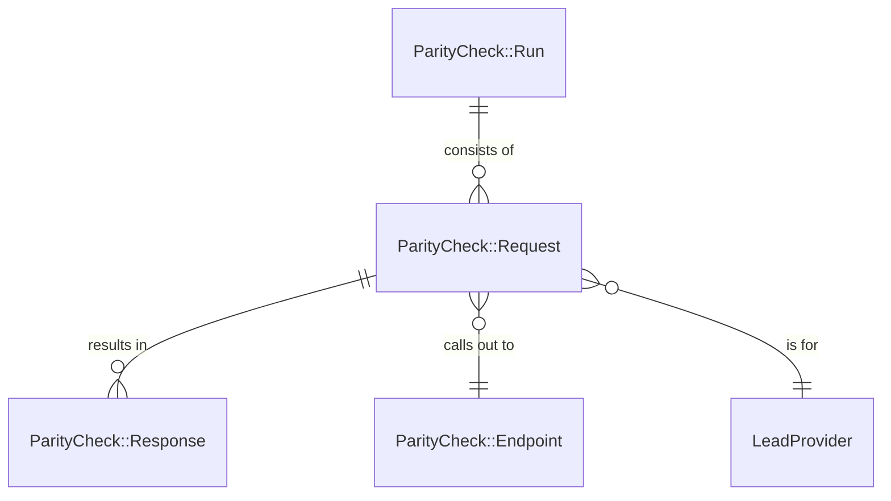
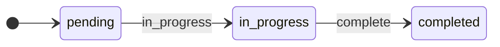
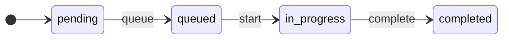
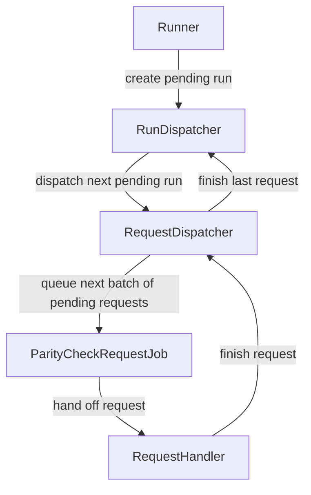
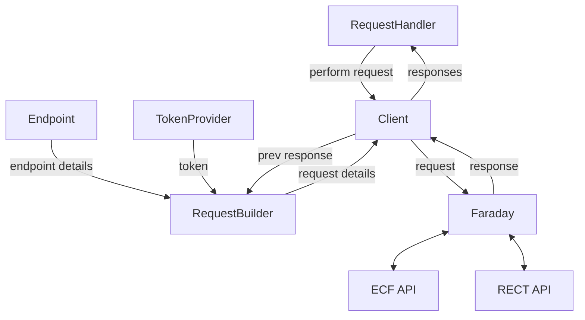

# Parity check

The parity check is a service that compares lead provider API requests between ECF and RECT to ensure consistency in request/response structure and endpoint performance.

## Modelling

A parity check consists of a `Run`, which has multiple `Requests`. Each `Request` will hit an `Endpoint` and the results are stored in a `Response`.

### Entity relationship diagram



## Data

### Endpoint data

The endpoints are defined in the `parity_check_endpoints.yml` file. The file describes all the endpoints we can call as part of the parity check, grouped by the request method, for example:

```yaml
get:
  "/api/v3/statements":
    paginate: true
  "/api/v3/statements":
    query:
      filter:
        cohort: 2021
  "/api/v3/statements/:id":
    id: statement_id
post:
  "/api/v3/statements":
    body: example_statement_body
```

In the above example, we have `get` and `post` endpoints:

- The `/api/v3/statements` endpoint will be paginated (so all pages are requested in the parity check). 
- The other request to `/api/v3/statements` will append query parameters, so the request will be to `/api/v3/statements?filter[cohort]=2021`. 
- The final `get` endpoint has a dynamic path ID; there must be a method `statement_id` in the `RequestBuilder` service that will be called and interpolated into the path as the `:id` parameter.
- The `post` endpoint defines a dynamic body for the request; there must be a method `example_statement_body` in the `RequestBuilder` that will be called and passed as request body.

### Tokens

We need lead provider API tokens for ECF and RECT in order to make API requests to the applications. To make life easier, we populate the migration databases with the same tokens for each lead provider using the `TokenProvider` service. This service loads the known tokens from a keyvault and creates them during the deploy to the migration environment.

### State diagrams

### Run



A `Run` starts as `pending` when first created by the `Runner`. The `RunDispatcher` moves runs from `pending` to `in_progress`. When the last request completes and calls the `RequestDispatcher` it will move the `Run` to `completed` (as there are no more requests to dispatch).

### Request



A `Request` starts as `pending` when first created by the `Runner`. When the `RequestDispatcher` is called it finds the next requests that can be dispatched and marks them as `queued`. The `ParityCheckRequestJob` picks up a `queued` request and marks it as `in_progress`. When the job has finished processing the request it moves it to `completed`. 

## Coordinating runs/requests

The parity check run control is fairly complicated, but it aims to satisfy the following requirements:

- We want to be able to queue up multiple runs on the same environment.
- We don't ever want runs to overlap.
- We want to have control over how requests are processed (concurrently vs sequentially).

### Description

At a high-level, the process is as follows:

- The `Runner` is called for a set of endpoints. 
- The `Runner` creates a new `Run` and associated `Request`(s) in the database in a `pending` state and calls the `RunDispatcher`.
- The `RunDispatcher` dispatches the next pending `Run` by making the initial call to `RequestDispatcher` for the `Run`.
- The `RequestDispatcher` determines the `Request`(s) to run next, marks them as `queued` and queues a `ParityCheckRequestJob` for each.
- The `ParityCheckRequestJob` is picked up by a worker and hands off the request to the `RequestHandler`.
- The `RequestHandler` marks the request as `in_progress`, calls RECT/ECF, marks the request as `completed` and calls the `RequestDispatcher`.
- When the `RequestDispatcher` is called and all `Request`(s) have been completed, it marks the `Run` as `completed` and calls the `RunDispatcher`.

The `RunDispatcher` and `RequestDispatcher` are responsible for the majority of the coordination; they can't be called too many times (they do nothing if a run or requests are in-flight). They have two external requirements, however:

- `RunDispatcher` must be called when a `Run` is created or completed.
- `RequestDispatcher` must be called after every request is completed.


### Flowchart



## Request handling

The `RequestHandler` kicks off a process to interpret and make a request to the ECF and RECT services for an `Endpoint`. A number of services work together to make this happen.

### Description

At a high-level, the process is as follows:

- The `RequestHandler` asks the `Client` to perform the `Request`.
- The `Client` calls a `RequestBuilder` to interpolate the `Endpoint` into valid request components (url, method, body, headers etc).
- The `RequestBuilder` will also call out to the `TokenProvider` to get a valid token for the authentication header.
- The `Client` runs the request through `Faraday` using an parallel adapter, so we call RECT and ECF at the same time.
- The `Client` returns the `Response` to the `RequestHandler`, which then attaches it to the `Request`.
- The `Client` asks the `RequestBuilder` if there are more pages (passing in the previous `Response`)
- If there are, the `Client` process repeats for subsequent pages (the `RequestBuilder` maintains page state).

### Flowchart


