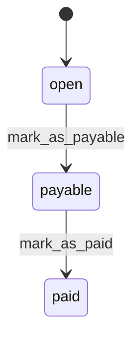

# State machines

We have a number of state machines in our models that describe the valid transitions between different states that a model can be in (using the [state_machines-activerecord](https://github.com/state-machines/state_machines-activerecord) gem).

This document details the state machines and the various transitions that they support.

State diagrams are in the [mermaid](https://mermaid.js.org/) format and can be generated by pasting the state machine definitions from the model into your favourite AI chatbot.

## Statement

A statement has three possible states:

- `open` is the initial state of a statement - the `deadline_date` of the statement is in the future.
- `payable` when the `deadline_date` of the statement is now in the past (it is picked up by a background job).
- `paid` when the statement has been manually marked as paid by a finance user (historically a developer marked as paid with a rake task).

There are two transitions a statement can go through:

- `mark_as_payable` transitions a statement from `open` to the `payable` state. This happens when the `deadline_date` of the statement has passed.
- `mark_as_paid` transitions a statement from `payable` to `paid`. This happens when a finance user manually triggers the transition in the finance dashboard.

