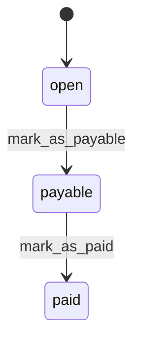
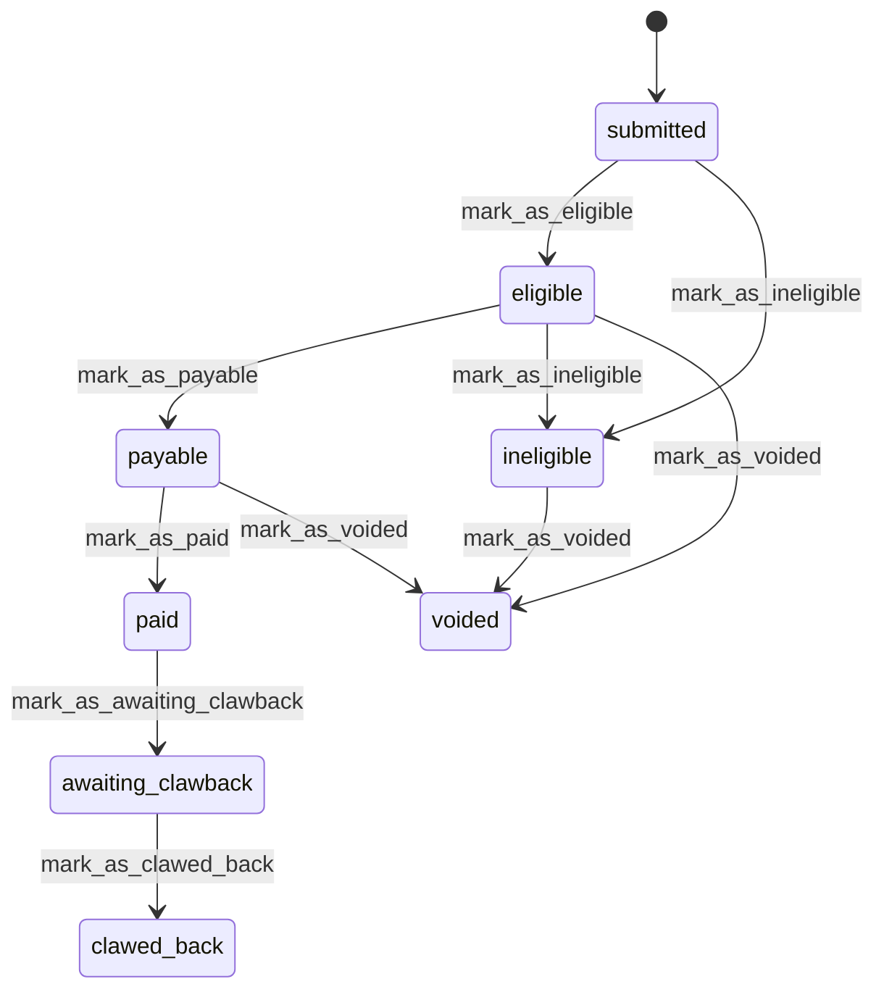

# State machines

We have a number of state machines in our models that describe the valid transitions between different states that a model can be in (using the [state_machines-activerecord](https://github.com/state-machines/state_machines-activerecord) gem).

This document details the state machines and the various transitions that they support.

State diagrams are in the [mermaid](https://mermaid.js.org/) format and can be generated by pasting the state machine definitions from the model into your favourite AI chatbot.

## Statement

A statement has three possible states:

- `open` is the initial state of a statement - the `deadline_date` of the statement is in the future.
- `payable` when the `deadline_date` of the statement is now in the past (it is picked up by a background job).
- `paid` when the statement has been manually marked as paid by a finance user (historically a developer marked as paid with a rake task).

There are two transitions a statement can go through:

- `mark_as_payable` transitions a statement from `open` to the `payable` state. This happens when the `deadline_date` of the statement has passed.
- `mark_as_paid` transitions a statement from `payable` to `paid`. This happens when a finance user manually triggers the transition in the finance dashboard.

## Declaration

A declaration supports the following states:

- `submitted` is the initial state of a declaration; if the participant is not eligible for funding and there are no duplicate declarations then the declaration remains in this state.
- `eligible` is the initial state of an item that will progress towards payment.
- `payable` once it has been confirmed for payment.
- `paid` when the item has been paid.
- `voided` when the item as been cancelled before being paid.
- `ineligible` when the item does not qualify for payment.
- `awaiting_clawback` is the state after a clawback has been initiated for a paid declaration.
- `clawed_back` once the amount has successfully been reclaimed.

There are seven transitions a declaration can go through:

- `mark_as_eligible` transitions a declaration from `submitted` to `eligible`. This happens on submitting a declaration if there are no duplicates and the participant is eligible for funding.
- `mark_as_ineligible` transitions a declaration from `submitted` to `ineligible`. This happens when there is a duplicate declaration for the participant.
- `mark_as_payable` transitions a declaration from `eligible` to `payable`. This happens on a daily job that picks up statements when the `deadline_date` has passed.
- `mark_as_paid` transitions a declaration from `payable` to `paid`. This happens when a finance user marks a statement as paid in the finance dashboard.
- `mark_as_awaiting_clawback` transitions a declaration from `paid` to `awaiting_clawback`. This happens when a paid declaration is voided by a lead provider.
- `mark_as_clawed_back` transitions a declaration from `awaiting_clawback` to `clawed_back`. This happens when a declaration is marked as refunded in the finance dashboard.
- `mark_as_voided` transitions a declaration from `eligible`, `ineligible` or `payable` to `voided`. This happens when a lead provider voids an unpaid declaration.

