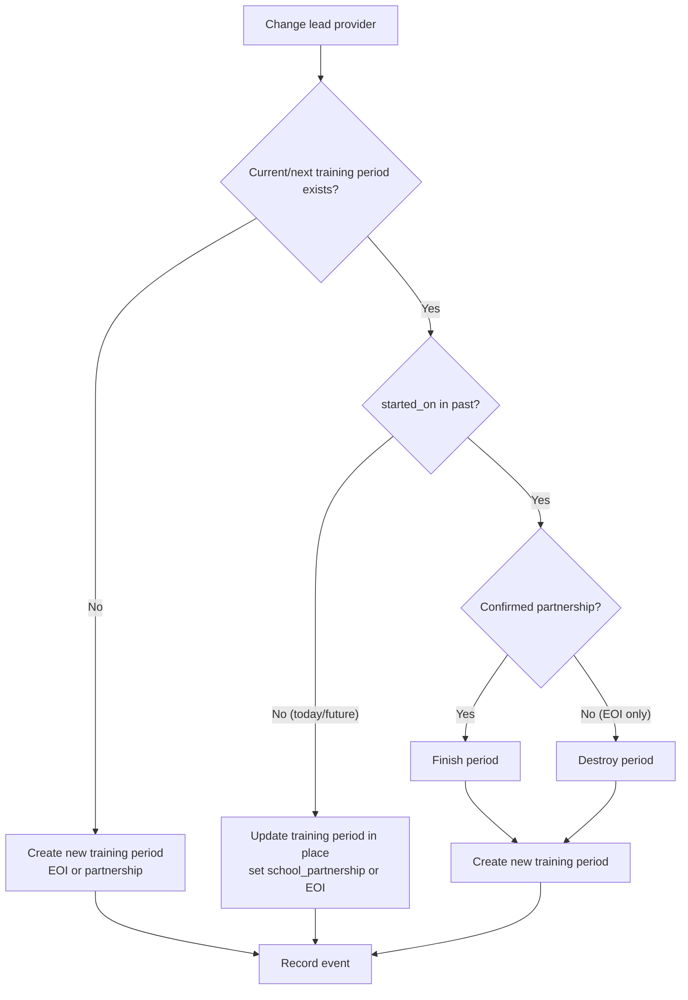

# Lead provider changes

```mermaid
flowchart TD
  A[Change lead provider] --> B{Current/next training period exists?}
  B -- No --> C["Create new training period<br>EOI or partnership"]
  B -- Yes --> D{started_on in past?}
  D -- No (today/future) --> E["Update training period in place<br>set school_partnership or EOI"]
  D -- Yes --> F{Confirmed partnership?}
  F -- Yes --> G[Finish period]
  F -- No (EOI only) --> H[Destroy period]
  G --> I[Create new training period]
  H --> I
  C --> J[Record event]
  E --> J
  I --> J
```
