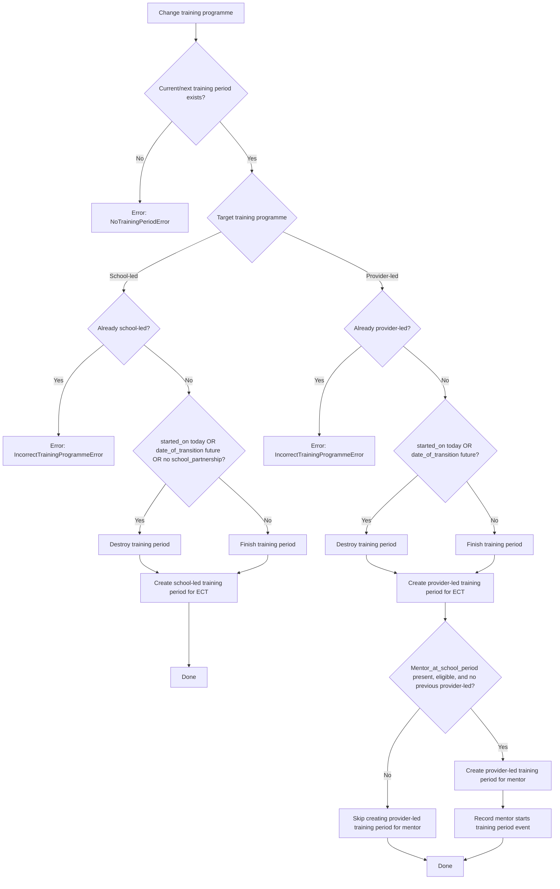

# Training programme changes

Source: `app/services/ect_at_school_periods/switch_training.rb`

```mermaid
flowchart TD
  A[Change training programme] --> B{Current/next training period exists?}
  B -- No --> BErr[Error: NoTrainingPeriodError]
  B -- Yes --> C{Target training programme}

  C -- School-led --> SL1{Already school-led?}
  SL1 -- Yes --> SLErr[Error: IncorrectTrainingProgrammeError]
  SL1 -- No --> SL2{started_on today OR date_of_transition future OR no school_partnership?}
  SL2 -- Yes --> SL3[Destroy training period]
  SL2 -- No --> SL4[Finish training period]
  SL3 --> SL5[Create school-led training period for ECT]
  SL4 --> SL5
  SL5 --> SLDone[Done]

  C -- Provider-led --> PL1{Already provider-led?}
  PL1 -- Yes --> PLErr[Error: IncorrectTrainingProgrammeError]
  PL1 -- No --> PL2{started_on today OR date_of_transition future?}
  PL2 -- Yes --> PL3[Destroy training period]
  PL2 -- No --> PL4[Finish training period]
  PL3 --> PL5[Create provider-led training period for ECT]
  PL4 --> PL5
  PL5 --> PL6{Mentor_at_school_period present, eligible, and no previous provider-led?}
  PL6 -- Yes --> PL7[Create provider-led training period for mentor]
  PL6 -- No --> PL8[Skip creating provider-led training period for mentor]
  PL7 --> PL9[Record mentor starts training period event]
  PL8 --> PLDone[Done]
  PL9 --> PLDone
```
